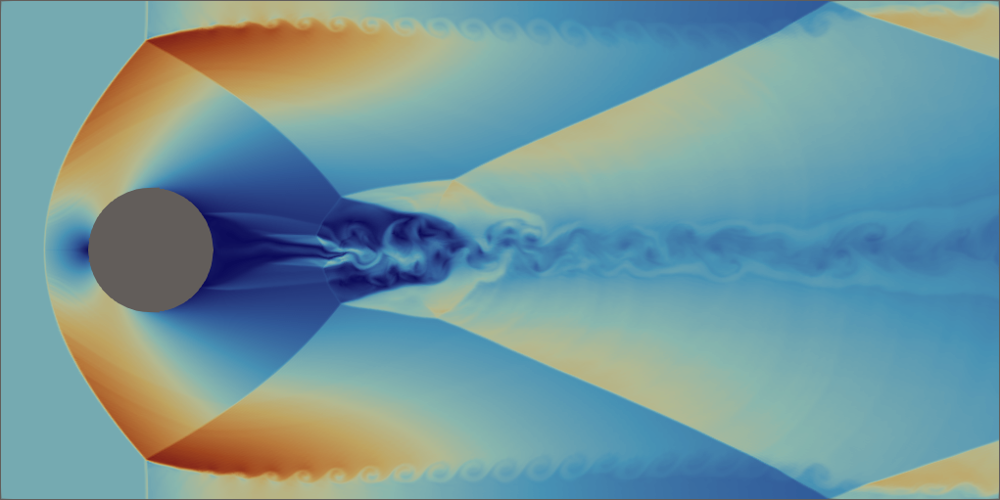
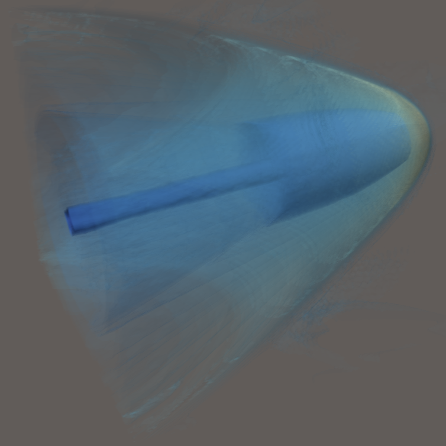
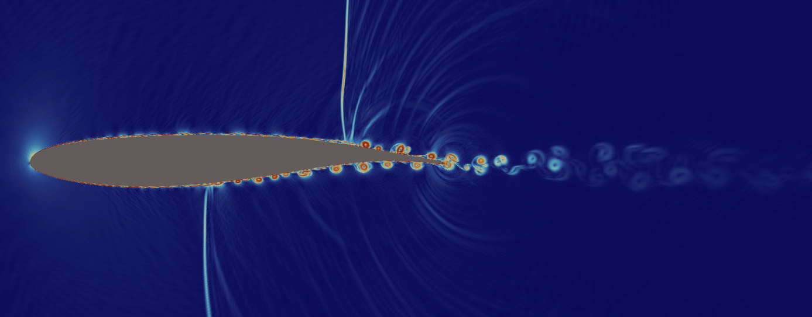
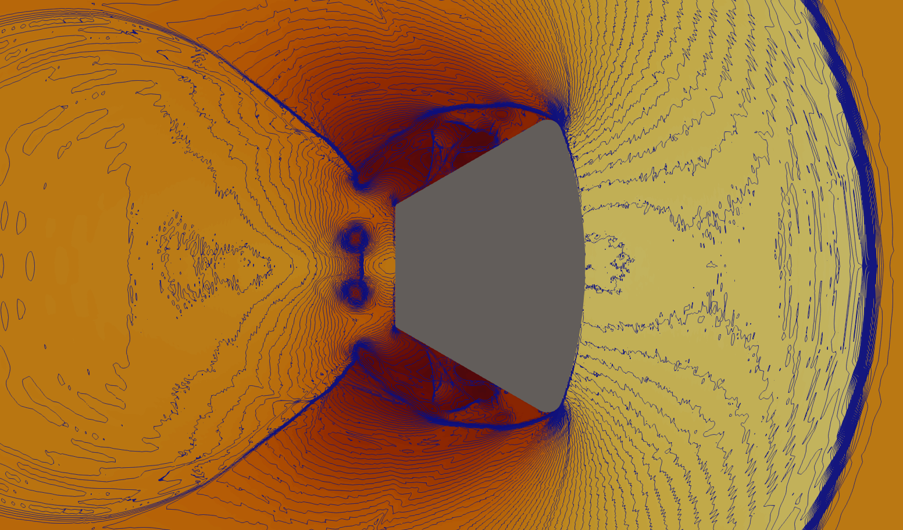
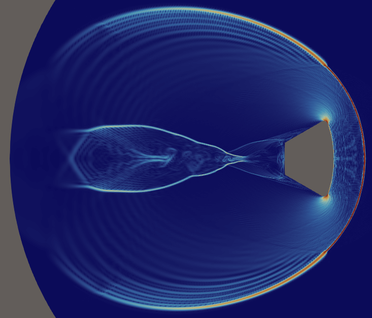

# Dragon2 Solver

Transient Direct Navier-Stokes solver, written in CUDA / C++

## Features

- Fast implementation
- 2D and 3D simulations
- Simple use: just load Gmsh mesh (.msh format), set boundary conditions, run

## Requirements

- NVIDIA GPU (RTX 3000/4000/5000 series or compatible)
- CUDA Toolkit 12.0+
- deal.II 9.3+ (finite element library)
- CMake 3.18+
- Linux (Ubuntu 22.04+ recommended)
- OpenMP

## Building

```bash
mkdir build && cd build
cmake -DDEAL_II_DIR=/path/to/dealii/install ..
make -j$(nproc)
```

Set DEAL_II_DIR to the path of deal.II installation

The build step detects GPU architecture (on CMake 3.24+.)
On older CMake versions it compiles for sm_86, sm_89, and sm_100.

## Quick Start

```bash
./solver_ns examples/cylinder-2d.cfg
./solver_ns --help
```

## Example Cases

| cylinder-2d.cfg | Cylinder flow | 2D |
| cylinder-3d.cfg | Cylinder flow | 3D |
| sphere-channel-3d.cfg | Sphere in channel | 3D |
| capsule-2d.cfg | Nasa capsule 120-CA Reentry | 2D |
| capsule-3d.cfg | Nasa capsule 120-CA Reentry | 3D |
| oat15a-2d.cfg | Onera OAT15a Transonic airfoil | 2D |

## Documentation

- [User Manual](docs/USER_MANUAL.md)
- [Test Cases](docs/TEST_CASES.md)

## License

Licensed under the Apache License 2.0. See LICENSE for details.

### - These are extracts of transcient Navier-Stokes simulations -

#### Cylinder Mach3, resp. in 2d and 3d:




#### Sphere flying at Mach3 inside a uniform channel (contour of density, 1.6 millions of cells):




#### Flow transonic with wing Onera OAT15a (contour of density, 0.5 million of points):




#### Atmospheric-entry of Nasa Capsule 120-CA

##### mesh with dealii:


##### solution as contour of density, 4.5 millions of points, Mach 8:


##### solution as contour of density with isolines, 0.4 millions of points, Mach 0.8:



##### solution as density, 0.4 millions of points, Mach 3:



