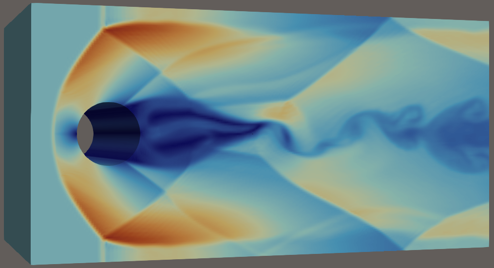

<div align="center">
<pre>
██████╗ ██████╗  █████╗  ██████╗  ██████╗ ███╗   ██╗    ██╗██╗
██╔══██╗██╔══██╗██╔══██╗██╔════╝ ██╔═══██╗████╗  ██║    ██║██║
██║  ██║██████╔╝███████║██║  ███╗██║   ██║██╔██╗ ██║    ██║██║
██║  ██║██╔══██╗██╔══██║██║   ██║██║   ██║██║╚██╗██║    ██║██║
██████╔╝██║  ██║██║  ██║╚██████╔╝╚██████╔╝██║ ╚████║    ██║██║
╚═════╝ ╚═╝  ╚═╝╚═╝  ╚═╝ ╚═════╝  ╚═════╝ ╚═╝  ╚═══╝    ╚═╝╚═╝
</pre>
</div>

# DRAGON II - Experimental CUDA Navier-Stokes Solver - in development

## Description
This project is a CUDA port of the solver ryujin (https://github.com/conservation-laws/ryujin).
It is not a fork as most of the original code has been entirely rewritten for CUDA, and it is not an official contribution.

## Key Concepts
The approach followed here is to transfer the entire computation on the GPU to offer maximal speed.

## Remarks
- Version II (Navier-Stokes)
- Single GPU computation
- Except for the generation of output files, libraries OpenMP, MPI and SIMD have been removed, as all computations are done on the GPU

## Supported OS
Tested on Ubuntu 24.04

## Prerequisites
Tested with Nvidia RTX 4000 and RTX 5000 generation cards

## Build and run

### Build with:
```bash
cd build/
cmake ..
make
```

### Then run with:
```bash
./solver_ns
```

### - These are extracts of transcient Navier-Stokes simulations -

#### Cylinder Mach3, resp. in 2d and 3d:




#### Sphere flying at Mach3 inside a uniform channel (contour of density, 1.6 millions of cells):


#### Flow transonic with wing Onera OAT15a (contour of density, 2 millions of points):


#### Atmospheric-entry of Nasa Capsule 120-CA

##### mesh with dealii:


##### solution as contour of density, 4.5 millions of points, Mach8:


